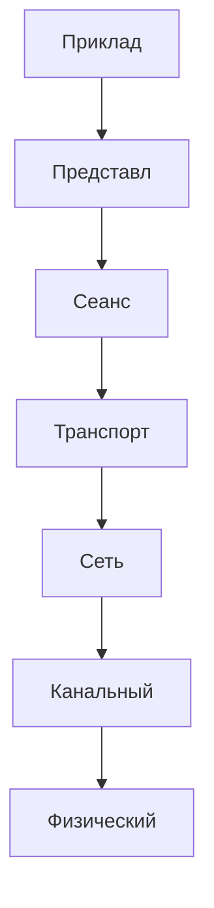

# Модель OSI — «предсказуемый мир интернета»

Модель OSI (Open Systems Interconnection) — это **7-ярусная архитектура**, разработанная ISO в 1984 году. Она стандартизирует взаимодействие сетевых устройств.

> **Почему она важна?**
>
> - Делает сети совместимыми (Windows ↔ Linux)
> - Упрощает решение проблем («ошибка на физическом уровне»)
> - Модульность: разработчики работают над отдельными уровнями.

---

## Семь уровней OSI

1. **Физический уровень**  
   Передача битов через кабели/воздух (Ethernet, Wi-Fi).
2. **Канальный уровень**  
   Управление доступом и коррекцией ошибок (MAC-адреса).
3. **Сетевой уровень** Маршрутизация пакетов через IP-адреса.

4. **Транспортный уровень** Надежная доставка данных (TCP/UDP).

5. **Сеансовый уровень** Управление «разговорами» между приложениями.

6. **Представительский уровень** Кодирование и безопасность данных (SSL/TLS).

7. **Прикладной уровень** Приложения: браузеры, email-клиенты.

---

# Физический уровень — «голос в трубе»

**Что здесь происходит?**

- Передача **битов** (0/1) по кабелю, радио, оптике.
- Определяет:
  - Тип сигнала (электрический, световой)
  - Скорость передачи (например: 1 Gbps Ethernet)
  - Физические соединения (RJ45 порт)

> **Пример:**  
> Wi-Fi-роутер шлет ваши данные по воздуху — это физический уровень!

---

# Канальный уровень — «полиция локальной сети»

**Задачи:**

- Регулировка доступа к каналу (как светофор в пробке).
- Идентификация устройств через **MAC-адрес**
  _(00:1A:2B:3C:4D:5E)_
- Обнаружение и исправление ошибок.

> **Пример:**  
> Ваш ноутбук спрашивает роутер: «Этот пакет дошел?» — канальный уровень обрабатывает ответ.

---

# Сетевой уровень — «навигатор данных»

**Что делает:**

- Определяет **маршруты между сетями** (через IP-адреса).
- Разбивает данные на пакеты (IP пакеты).
- Управление загрузкой и QoS.

> **Интересный факт:**  
> Если вы смотрите видео, ваши пакеты могут перепрыгнуть океан благодаря этому уровню!

---

# Транспортный уровень — «контроль качества связи»

**Протоколы:**

- **TCP** (Transmission Control Protocol):
  - Обеспечивает надежную доставку.
  - Используется в HTTP, FTP.
- **UDP** (User Datagram Protocol):
  - Быстрая передача без гарантий (например, VoIP).

> **Аналогия:**  
> TCP как курьер с подтверждением получения. UDP — бросание пакета через окно!

---

# Как данные проходят все уровни?

**Путь от приложения к физическому сигналу:**

1. Прикладной → Представительный → Сеансовый
2. Транспортный → Сетевой → Канальный
3. Физический (передача через провод/воздух)

---

# Применение модели в реальной жизни

1. **Отладка проблем:**  
   «Пинг не проходит?» → Проверяйте физический/канальный уровень.

2. **Разработка новых технологий:**  
   Создание Wi-Fi 6 начинается с понимания физического уровня.

3. **Безопасность:**  
   Представительный уровень защищает данные через TLS.

> **Концепция «через призму OSI»:**  
> Используется в сертификациях (Cisco, CompTIA) и при разработке сетевого ПО.
